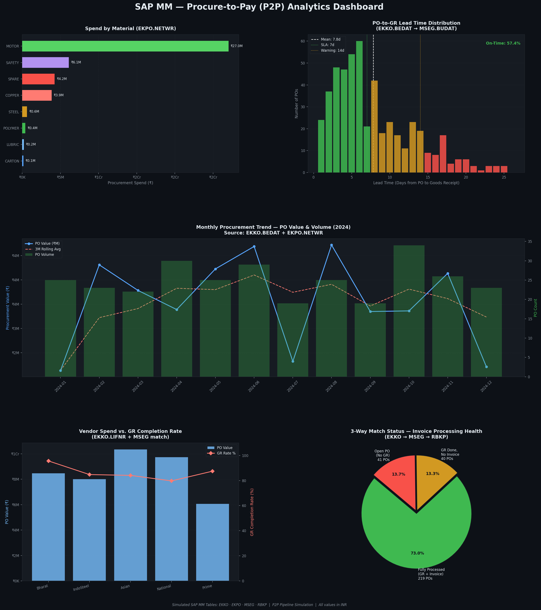

# SAP MM — Procure-to-Pay (P2P) Analytics Pipeline

> A Python simulation of the SAP MM P2P data pipeline, replicating the relational
> structure of four core SAP MM/FI tables and delivering five enterprise-grade analytics charts.

**Program:** SAP Data Analytics | ExcelR & KIIT University | B6 Batch  
**Domain:** SAP MM · ERP Systems · Procurement Analytics  
**Submission:** Capstone Project — April 2026

---

## Pipeline KPIs (Simulation Output)

| Metric | Value |
|--------|-------|
| Purchase Orders | 300 |
| Total Line Items | 592 |
| GR Completion Rate | 85.6% |
| Avg. PO-to-GR Lead Time | 7.8 days |
| On-Time GR Rate (≤ 7 days) | 57.4% |
| Total PO Value | ₹4.26 Cr |
| Invoiced Amount | ₹3.07 Cr |
| Open AP Exposure | ₹1.20 Cr |

---

## SAP Tables Simulated

| Table | Description | Primary Key |
|-------|-------------|-------------|
| `EKKO` | Purchase Order Header | `EBELN` |
| `EKPO` | Purchase Order Item | `EBELN + EBELP` |
| `MSEG` | Material Document (Goods Receipt) | `MBLNR + ZEILE` |
| `RBKP` | Invoice Receipt Header (MIRO) | `BELNR + GJAHR` |

---

## Dashboard

The pipeline generates a 5-chart dark-themed analytics dashboard:

1. **Spend by Material** — EKPO.NETWR aggregation by MATNR
2. **PO-to-GR Lead Time Distribution** — SLA zones (green/amber/red) with mean line
3. **Monthly Procurement Trend** — dual-axis (PO value + order volume + 3M rolling avg)
4. **Vendor Spend vs. GR Completion Rate** — procurement performance scorecard
5. **Three-Way Match Status** — invoice processing health (pie chart)



---

## Join Architecture

The pipeline uses a deliberate inner/left join strategy to replicate SAP's open-items logic:

```python
# Step 1: PO Header + Items (inner join — a PO must have items to be valid)
df = ekko.merge(ekpo, on='EBELN', how='inner', suffixes=('_HDR', '_ITM'))

# Step 2: Attach Goods Receipt (left join — preserves open POs with no GR yet)
df = df.merge(mseg_key, on=['EBELN', 'EBELP'], how='left')

# Step 3: Attach Invoice (left join — preserves GR-done-but-not-invoiced POs)
df = df.merge(rbkp_key, on='EBELN', how='left')
```

This ensures open POs — the most operationally critical records — are never silently discarded.

---

## Installation & Usage

```bash
# Clone the repo
git clone https://github.com/[your-username]/SAP-P2P-Analytics-Pipeline.git
cd SAP-P2P-Analytics-Pipeline

# Install dependencies
pip install pandas numpy matplotlib

# Run the pipeline
python sap_p2p_pipeline.py
```

Output files generated:
- `sap_p2p_dashboard.png` — the analytics dashboard
- Console KPI summary printed to stdout

---

## Tech Stack

| Technology | Role |
|------------|------|
| Python 3.11 | Pipeline orchestration |
| pandas 2.x | DataFrame joins, time arithmetic |
| NumPy | Seeded data simulation |
| Matplotlib + GridSpec | Dashboard rendering |
| FuncFormatter | ₹ currency axis labels |

---

## Project Structure

```
SAP-P2P-Analytics-Pipeline/
├── sap_p2p_pipeline.py          # Main analytics pipeline
├── sap_p2p_dashboard.png        # Generated dashboard output
├── sap_p2p_capstone_report.docx # Project report (Word)
└── README.md
```

---

## Key Design Decisions

- **Inner join EKKO↔EKPO**: A PO without line items is structurally invalid
- **Left join for MSEG**: Preserves open POs (no GR yet) — critical for procurement monitoring  
- **Left join for RBKP**: Preserves unmatched invoices — critical for AP exposure tracking
- **np.random.seed(42)**: Guarantees reproducible results for academic validation
- **EKKO field names (LIFNR, BEDAT, EKORG)**: Architecturally authentic — identical to real SAP

---

*SAP Data Analytics Program · ExcelR & KIIT University · B6 Batch · Capstone Project 2026*
